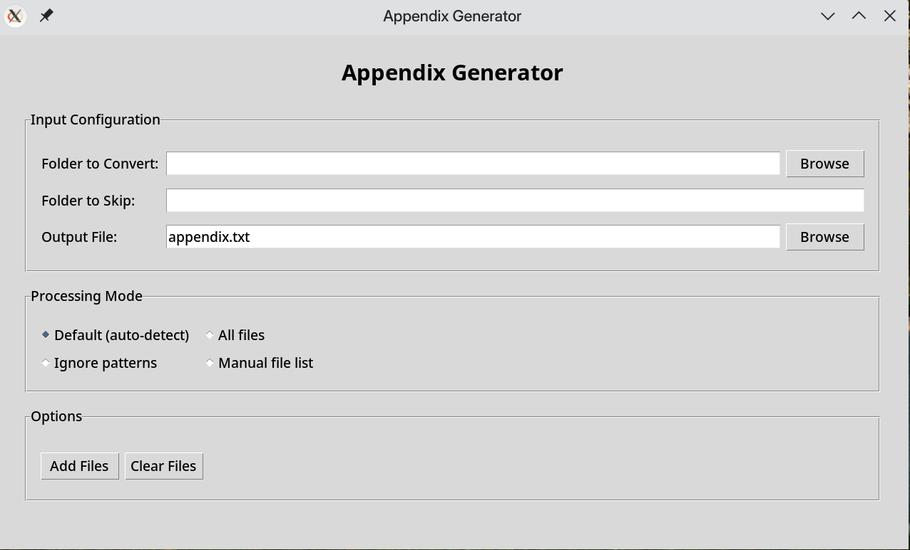

# AppendixD
- Convert all your code to a single .txt file.
- Aimed at IBDP Computer Science IA Appendix D.(hence AppendixD, also XD, get it?)
- Both GUI (tkinter) and CLI support.
- Intended to be used as more of an "use and throw" tool (that's why there's no installer or dependencies).

# Screenshot
<p align="center">
<br>
</p>

## Usage

### GUI

To use the graphical interface, run:

```bash
python appendixd_gui.py
```

-   Select the folder to convert and (optionally) a folder to skip.
-   Set the output file (defaults to `appendix.txt`).
-   Choose the processing mode and provide ignore patterns or manual file list as needed.
-   Click **Generate Appendix** to create the appendix.
-   Use **Download Last File** to save the generated file to a location of your choice.
-   Use **Clear All** to reset the form.

### CLI
You can also use the script from the command line:

```bash
python appendixd.py --folder <path_to_folder> [--skip-folder <folder_to_skip>] [--output <output_filename>]
```

#### Parameters:

-   `--folder`: The path to the folder containing the files you want to convert. (Required)
-   `--skip-folder`: Skip any folder (Optional)
-   `--output`: The name of the output file. (Optional, Default=`appendix.txt`)

#### Example:

```bash
python appendixd.py --folder ./my_project --skip-folder temp --output my_project_appendix.txt
```
